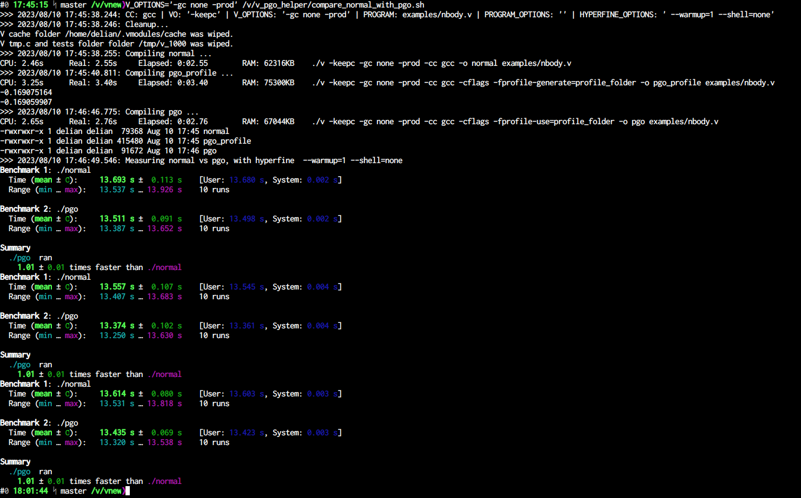

Purpose:
===================
This repo contains a small tool, that makes easier comparisons of the
performance, between normally compiled V programs, and V programs compiled
with PGO, using gcc or other C compilers, that support PGO.

Usage:
===================

```bash
cd /folder/to/your/V
/path/to/repo/compare_normal_with_pgo.sh
```

You can parametrise it, by setting environment variables, for example:
`V_OPTIONS='-gc none -prod' /path/to/repo/compare_normal_with_pgo.sh`

See [compare_normal_with_pgo.sh](./compare_normal_with_pgo.sh) for
a list of the supported env variables.

Prerequisites:
===================
V, GCC, hyperfine

How it looks:
===================

